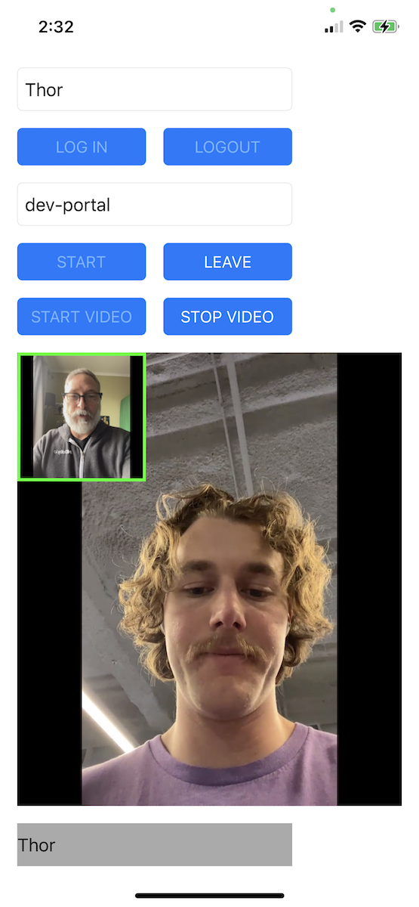
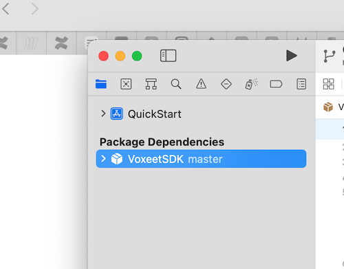
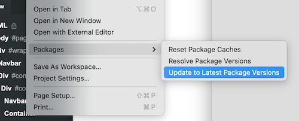
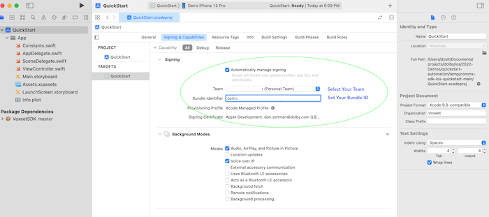
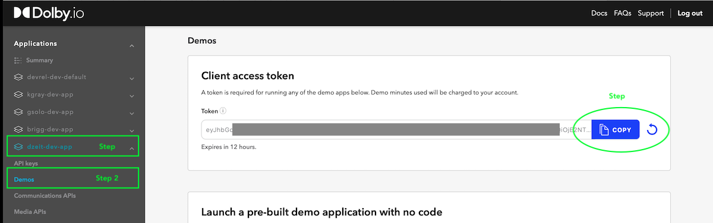
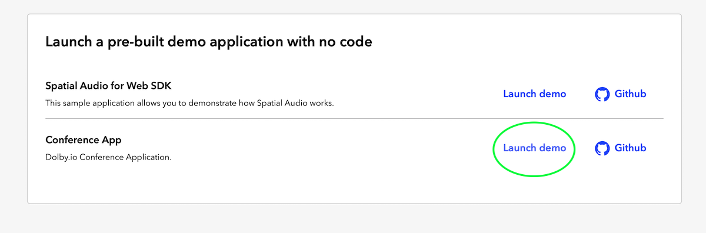
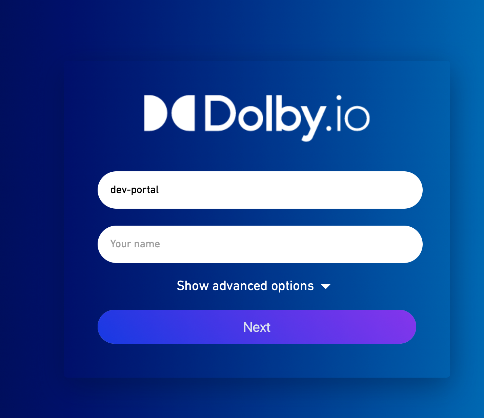
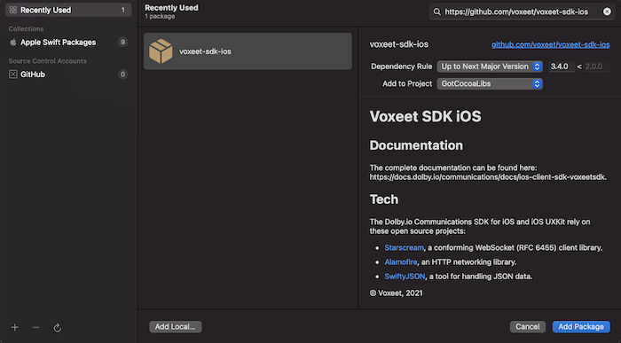

# :warning: This repository is no longer maintained :warning:

# Dolby.io Communications APIs iOS SDK UIKIT Quick Start App
This Quick Start Application is a simple audio and video conference example using the Dolby.io Communications API. 



This version will focus it's implementation using **Swift** and **UiKit**.  You'll need to [Sign Up for a Dolby.io](https://www.dolby.io/signup) account to run the app. 
## Build and Run
We've implemented Swift Package Manager from within XCode to add the Dolby.io SDK to this project.  We'll create and use a Developer Token while in developement, and recommend you use a token service for production deployment. 

1. Download this application repo to your local computer and open with xCode.
2. Sync and update the SDK to the latest version. Select The VoxeetSDK from the package dependancies in the sidebar menu.


3. From the **File** menu, select **Packages**, **"Update to the latest version"**. This will resync the SDK to the latest version.
  
 
4. Make sure your project's **Bundle identifier** and **Team Account** is set for your developement environment.
   - Select the project's target and Signings and Capibilities Tab.
   - Select your team and set the project's bundle ID.
   
      Typically, "com.**teamid**.ios.quickstart" where **teamid** equals your team id.


5. Open Constants.swift and if missing, replace the **API_TOKEN** with your developer token.  This is a **Client Access Token**, used to initialize the SDK from client applications. 

    For the purposes of a quick demo, you can find a time-limited token with a 12 hr lifespan in our [developer dashboard](https://dashboard.dolby.io), create or select an application, tap demos link and copy your developer token. You'll use replace that value in your Constants.swift file.



```
Note: Our demo token is designed to get you quickly and securely started, since it has a short expiration time.  In a production app you would add addtional application mased authentication and generate and retrieve the client access token from a server. 
```

Review our [REST API Documentation](https://docs.dolby.io/communications-apis/reference/get-client-access-token) details how to create the client access token.  

  
## Build and Run your Application.
Build and run your application on your device. The demo must be run on your device and not the simulator in order to use to use the mic and camera features.


 You can test the app with another particpant by going back to the demos section in the developer dashboard, selecting your app and the **Demos** link in the sidebar, select the **Conference App's Launch Demo** link to launch web-based conference app that's using the same token.

 

 Set the conference is to **dev-port** or matching conference you've selected on your device's Login screen and login and run the app on the device and in the browser, you should be able to see both participants.

 

### Notes:
- The Dolby.io Communications API SDK is currently named VoxeetSDK. 
- If you have any issues with the SDK not being recognized; try updating the packages or re-installing the package SDK. (See below)

 
## Installing the SDK with Swift Package Manager

The Swift Package Manager is a tool for automating the process of downloading, compiling, and linking dependencies. The Swift Package Manager is supported in SDK 3.4.0 and later versions. This project included the Dolby.io Swift Package, so it's unlikely that you'll need to follow these instructions to re-install it. 

1. Select `File` ▸ `Add Packages…` to add package dependency.

2. In the opened window, find the search box and specify the URL to the SDK repository: https://github.com/voxeet/voxeet-sdk-ios.

3. Choose voxeet-sdk-ios from the results list.

4. Select the proper SDK version from the `Dependency Rule` dropdown list.
   
    

5. Select the `Add Package` option.

You can find additional reference documentation here:
- [iOS Reference](https://docs.dolby.io/communications/docs/ios-client-sdk-voxeetsdk)
