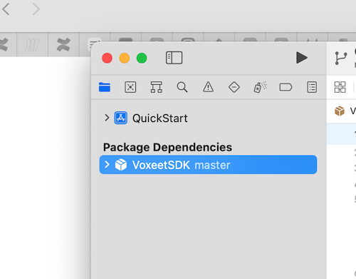
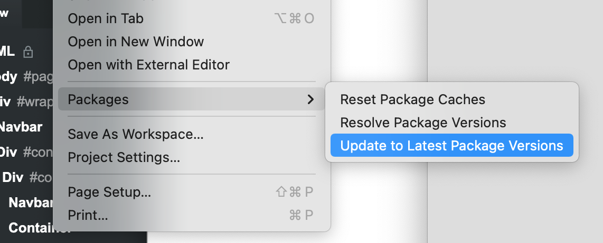

# Dolby.io Communications APIs iOS SDK Quick Start App
This Quick Start Application is a simple audio and video conference example using the Dolby.io Communications API. You'll need to [Sign Up for a Dolby.io](https://www.dolby.io/signup) account to run the app. 
## Build and Run
We've implemented Swift Package Manager from within XCode to add the Dolby.io SDK to this project.  We'll create and use a Developer Token while in developement, and recommend you use a token service for production deployment. 

- Download the app and open with xCode.
- Select The VoxeetSDK from the package dependancies in the sidebar menu.

- From the File menu, select Packages, Update to the latest version. This will resync the SDK to the latest version.
  
 

- Finally, select the project's target and Signings and Capibilities Tab.
- Select your team and set the project's bundle ID.
  - Typically, com.**teamid**.ios.quickstart where **teamid** equals your team id.

- Open Constants.swift and if missing, replace the API_TOKEN with your developer token*.  Create a **Developer Token** with the handy [bookmarklet](https://developer-token-dolbyio.netlify.app).
  
- Build and run your application.
- You can test the app with another particpant by going to the developer dashboard at https://dashboard.dolby.io/dashboard/applications/summary and selecting your app and the communications apis link in the sidebar, select the test tab and join a conference.

### Notes:
- The Dolby.io Communications API SDK is currently VoxeetSDK. 
- If you have any issues with the SDK not being recognized; try updating the packages or re-installing the package SDK. (See below)

 
## Installing the SDK with Swift Package Manager

The Swift Package Manager is a tool for automating the process of downloading, compiling, and linking dependencies. The Swift Package Manager is supported in SDK 3.4.0 and later versions. This project included the Dolby.io Swift Package, so it's unlikely that you'll need to follow these instructions to re-install it. 

1. Select `File` ▸ `Add Packages…` to add package dependency.

2. In the opened window, find the search box and specify the URL to the SDK repository: https://github.com/voxeet/voxeet-sdk-ios.

3. Choose voxeet-sdk-ios from the results list.

4. Select the proper SDK version from the `Dependency Rule` dropdown list.
   
    

5. Select the `Add Package` option.

You can find additional reference documentation here:
- [iOS Reference](https://docs.dolby.io/communications/docs/ios-client-sdk-voxeetsdk)