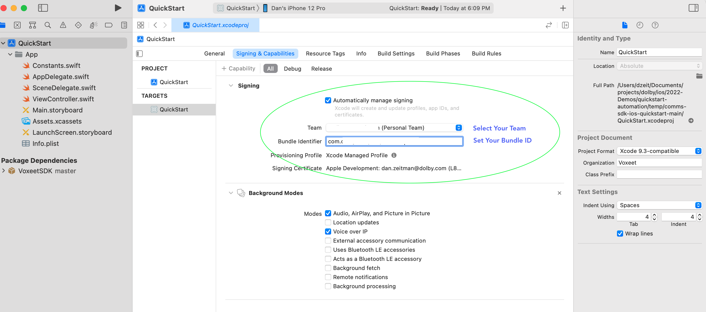

# Dolby.io Communications APIs iOS SDK Getting Started app

This is the sample app from the iOS app used in the
Getting Started article.  [Link Coming Soon]

You can find additional reference documentation here:
- [iOS Reference](https://docs.dolby.io/communications/docs/ios-client-sdk-voxeetsdk)

## Build and Run
We've implemented Swift Package Manager from within XCode to add the Dolby.io SDK to this project.  We'll use a Developer Token while in developement, and recommend you use a token service for production deployment.

- Download the app and open with xCode.
- Select the project's target and Signings and Capibilities Tab.
- Select your team and set the project's bundle ID.
  - Typically, com.**teamid**.ios.quickstart where **teamid** equals your team id.



- Open Constants.swift and if missing, replace the API_TOKEN with your developer token*. (See note below for generating a developer token)
  
- Build and run your application.
- You can test the app with another particpant by going to the developer dashboard at https://dashboard.dolby.io/dashboard/applications/summary and selecting your app and the communications apis link in the sidebar, select the test tab and join a conference.

### Tips:
- If you have any issues with the SDK not being recognized; try updating the packages or re-installing the package SDK. (See below)


### *Alternatively you can create a Developer Token with the handy bookmarklet:
- Step 1: Open this page in Chrome:
-  Step 2: Select View -> Always show Bookmarks Bar
-  Step 3: Drag this link to the Bookmarks Bar of the Chrome Browser.

<svg viewBox="0 0 200 200" xmlns="http://www.w3.org/2000/svg">
  <style>
    div {
      color: white;
      font: 18px serif;
      height: 100%;
      overflow: auto;
    }
  </style>

  <polygon points="5,5 195,10 185,185 10,195" />

  <!-- Common use case: embed HTML text into SVG -->
  <foreignObject x="20" y="20" width="160" height="160">
    <!--
      In the context of SVG embedded in an HTML document, the XHTML
      namespace could be omitted, but it is mandatory in the
      context of an SVG document
    -->
    <div xmlns="http://www.w3.org/1999/xhtml">
      Lorem ipsum dolor sit amet, consectetur adipiscing elit.
      Sed mollis mollis mi ut ultricies. Nullam magna ipsum,
      porta vel dui convallis, rutrum imperdiet eros. Aliquam
      erat volutpat.
      <a href="javascript:(() => {
        let delay = ms => new Promise(res => setTimeout(res, ms)); let button = document.querySelectorAll('button')[2];
        button.addEventListener('click', async (event) => {
            let done = await delay(3000);
            let key = document.querySelectorAll('input')[0].value;
            let secret = document.querySelectorAll('input')[1].value;
            var credentials = btoa(key + ':' + secret);
            let expiry = (3600 * 24 * 2);
            fetch('https://session.voxeet.com/v1/oauth2/token', {
                method: 'POST', headers: { 'Content-Type': 'application/json', 'Authorization': 'Basic ' + credentials }, body: JSON.stringify({ grant_type: 'client_credentials', expires_in: expiry })
            }).then(response => response.json()).then(data => {
                console.log('Success:', data, data['access_token']);
                navigator.clipboard.writeText(data['access_token']).then(() => { console.log('Text copied to clipboard...'); alert(`${ data['access_token'] } was written to the clipboard`);}).catch(err => { console.log('Something went wrong', err);})
            }).catch((error) => { console.error('Error:', error); alert('Error:', error); });
        });
        button.click();
    })();">Generate Developer Token - Dolby.io Comms API</a>
    </div>
  </foreignObject>
</svg>
 
- Step 4: Open <a href="https://dashboard.dolby.io/dashboard/applications/summary">Dolby.io Dashboard</a> and
        create a new project or select an existing project.
- Step 5: Click the link to display the API Keys.
        Once the page loads, click on the "Generate Developer Token - Dolby.io Comms API" bookmark to generate a 48 hr
        token.
- Paste the token into your project's constants settings to initalize the SDK. See example below.
  

  ```
   let API_TOKEN = "<REPLACE-WITH-YOUR-DEVELOPER-TOKEN>"
  ```
 
## Installing the SDK with Swift Package Manager

The Swift Package Manager is a tool for automating the process of downloading, compiling, and linking dependencies. The Swift Package Manager is supported in SDK 3.4.0 and later versions.

1. Select `File` ▸ `Add Packages…` to add package dependency.

2. In the opened window, find the search box and specify the URL to the SDK repository: https://github.com/voxeet/voxeet-sdk-ios.

3. Choose voxeet-sdk-ios from the results list.

4. Select the proper SDK version from the `Dependency Rule` dropdown list.
   
    

5. Select the `Add Package` option.
