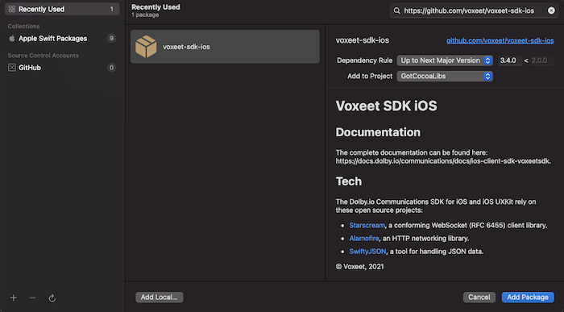

# Dolby.io Communications APIs iOS SDK Getting Started app

This is the sample app from the iOS app used in the
Getting Started article.  [Link Coming Soon]

You can find additional reference documentation here:
- [iOS Reference](https://docs.dolby.io/communications/docs/ios-client-sdk-voxeetsdk)

## Building
We've implemented Swift Package Manager from within XCode to add the Dolby.io SDK to this project.

## Installing the SDK with Swift Package Manager

The Swift Package Manager is a tool for automating the process of downloading, compiling, and linking dependencies. The Swift Package Manager is supported in SDK 3.4.0 and later versions.

1. Select `File` ▸ `Add Packages…` to add package dependency.

2. In the opened window, find the search box and specify the URL to the SDK repository: https://github.com/voxeet/voxeet-sdk-ios.

3. Choose voxeet-sdk-ios from the results list.

4. Select the proper SDK version from the `Dependency Rule` dropdown list.
   
    

5. Select the `Add Package` option.